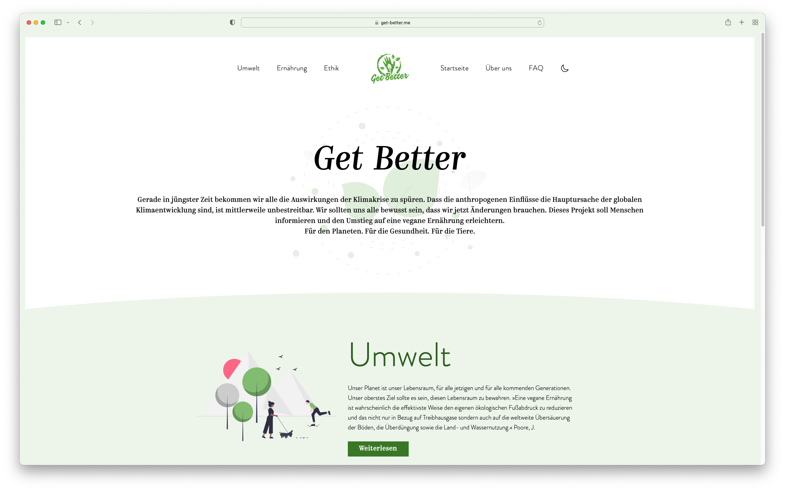

# Get Better

[](https://github.com/romanzipp/GetBetter/actions/workflows/ci.yml)
[](https://github.com/romanzipp/GetBetter/actions/workflows/cd.yml)



## Requirements

- [NodeJS](https://nodejs.org/en/)
- [Yarn](https://yarnpkg.com/)

## Build Setup

This project is based on the [NuxtJS](https://nuxtjs.org/) Vue frontend framework.

**Clone project**
```shell
git clone https://github.com/romanzipp/GetBetter.git
```

**Install dependencies**
```shell
yarn install
```

**Serve with hot reload at localhost:3000**
```shell
yarn dev
```

**Build for production and launch server**
```shell
yarn build
yarn start
```

**Generate static project**
```shell
yarn generate
```

**Check for linting errors**
```shell
yarn lint
```

## Content

[Content pages are located in /content](content)

## Deployment

This repository is hosted on [GitHub Pages](https://pages.github.com). The latest master commit will be [automatically deployed](.github/workflows/cd.yml). 

## Credits

- Icons: [ionicons](https://ionic.io/ionicons) ([MIT License](https://github.com/ionic-team/ionicons/blob/master/LICENSE))
- Illustrations: [Katerina Limpitsouni's](https://twitter.com/NinaLimpi) [undraw](https://undraw.co/license) ([License](https://undraw.co/license))
- Illustrations: [illu station](https://themeisle.com/illustrations)

## Authors

- [Roman Zipp](https://github.com/romanzipp)
- [Tamaaa](https://twitter.com/tamaaalol)
- [Mibbi](https://twitter.com/HeyMibbi)
